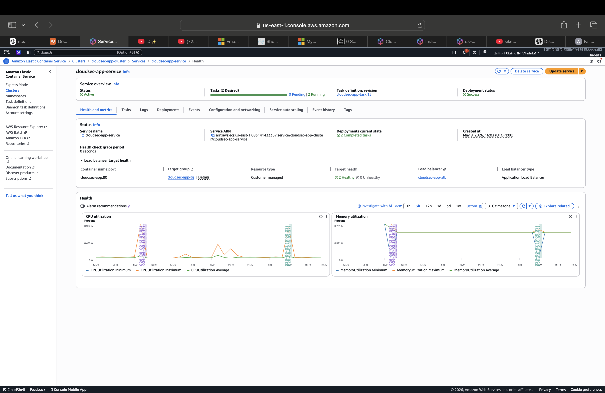
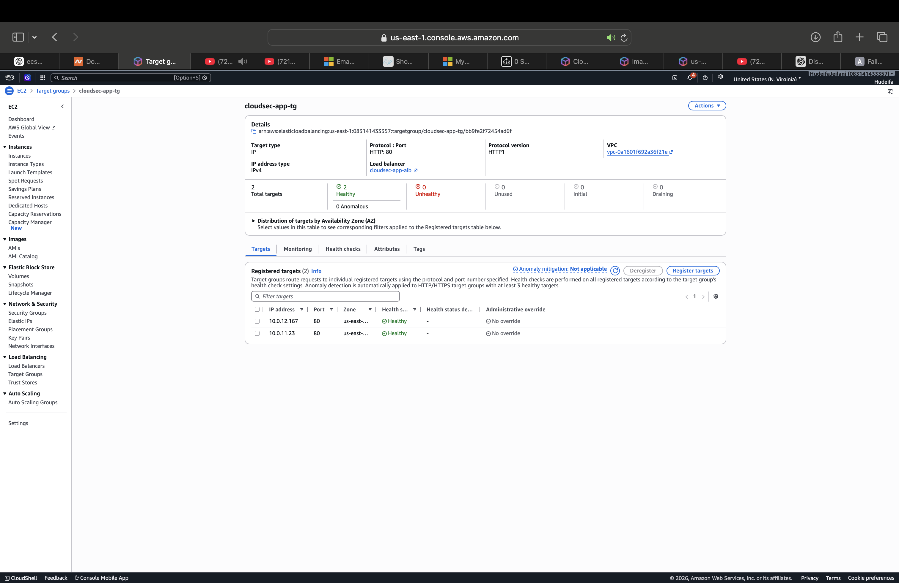

# Threat Composer Deployment Platform

Production-ready deployment of the Threat Composer application using:

- Docker
- Amazon ECS Fargate
- Application Load Balancer
- Amazon ECR
- Route53
- AWS Certificate Manager
- Terraform

Live deployment:

https://tm.hudeifadev.com

## Project Overview

This project was delivered for a client requiring a secure, scalable and fully reproducible deployment of the Threat Composer application on AWS.

The objective was to replace manual infrastructure provisioning with Infrastructure as Code while providing:

- HTTPS encryption
- Custom domain routing
- Containerized application deployment
- High availability across multiple Availability Zones
- Automated infrastructure provisioning through Terraform
- Scalable container orchestration using ECS Fargate

## Solution Architecture


## Infrastructure Components

### Networking
- Custom VPC
- 2 Public Subnets
- 2 Private Subnets
- Internet Gateway
- Route Tables

### Compute
- ECS Cluster
- ECS Service
- Fargate Tasks

### Load Balancing
- Application Load Balancer
- HTTP → HTTPS Redirect
- Target Group Health Checks

### Container Registry
- Amazon ECR

### DNS & TLS
- Route53 Hosted Zone
- ACM Certificate

## Repository Structure
infra/
├── backend.tf
├── bootstrap
│   ├── main.tf
│   └── terraform.tfstate
├── main.tf
├── modules
│   ├── acm_route53
│   │   ├── main.tf
│   │   ├── outputs.tf
│   │   └── variables.tf
│   ├── alb
│   │   ├── main.tf
│   │   ├── outputs.tf
│   │   └── variables.tf
│   ├── ecr
│   │   ├── main.tf
│   │   ├── outputs.tf
│   │   ├── variables .tf
│   │   └── variables.tf
│   ├── ecs
│   │   ├── main.tf
│   │   ├── outputs.tf
│   │   └── variables.tf
│   └── vpc
│       ├── main.tf
│       ├── outputs.tf
│       └── variables.tf
├── outputs.tf
├── provider.tf
├── terraform.tfstate
├── terraform.tfvars
└── variables.tf

src/
public/
dockerfile
nginx.conf
```

## Deployment Workflow

```text
Developer
    │
    ▼
Docker Build
    │
    ▼
Amazon ECR
    │
    ▼
Terraform Apply
    │
    ▼
Amazon ECS Fargate
    │
    ▼
Application Load Balancer
    │
    ▼
Route53
    │
    ▼
HTTPS Endpoint
```

### Application Running


### ECS Service Health



### Load Balancer Target Health




## Terraform Modules

### VPC Module

Creates:

- VPC
- Public Subnets
- Private Subnets
- Route Tables
- Internet Gateway

### ECR Module

Creates:

- Container Repository

### ALB Module

Creates:

- Application Load Balancer
- Target Group
- Listener Rules

### ECS Module

Creates:

- ECS Cluster
- Task Definition
- ECS Service

### ACM Route53 Module

Creates:

- DNS Records
- SSL Certificate
- Validation Records

## Security

Implemented security controls include:

- HTTPS enforced via ACM certificates
- HTTP to HTTPS redirection
- ECS tasks deployed in private subnets
- Security groups restricting inbound traffic
- Container images stored in private ECR repository
- Infrastructure managed through Terraform state locking

## Lessons Learned

Key challenges solved during delivery:

- ECS health check failures
- ALB target registration troubleshooting
- Route53 DNS propagation delays
- ACM certificate validation
- Terraform module refactoring
- Container image version management